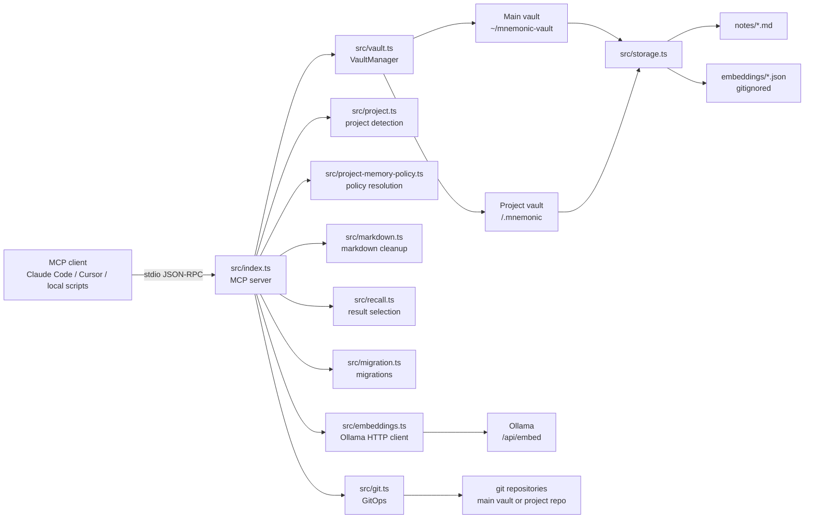
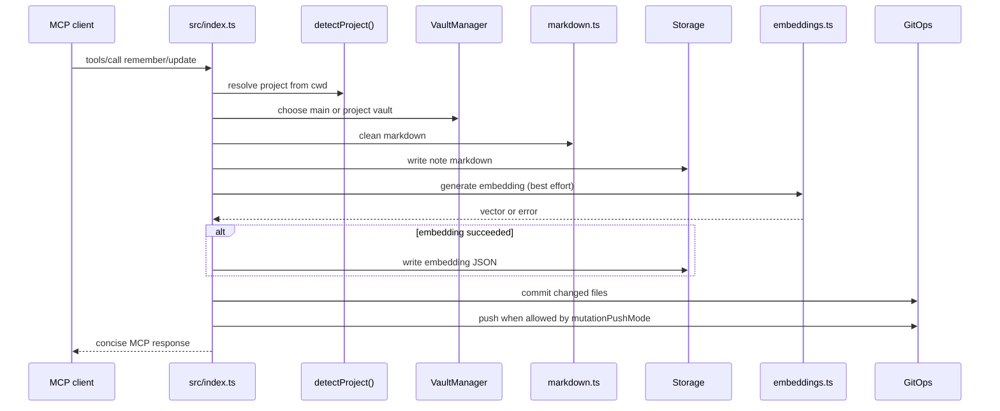
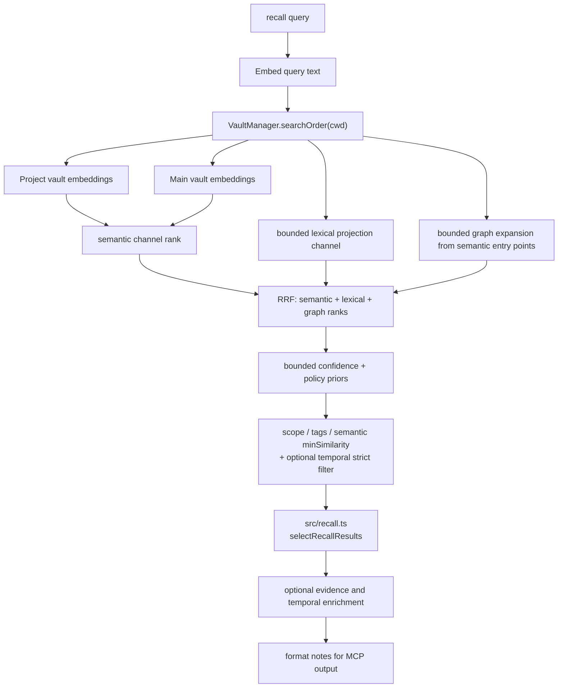

# Architecture

`mnemonic` is an MCP memory server built around files. It stores notes as markdown, keeps embeddings as local JSON, routes reads and writes across a main vault and optional project vaults, and uses git for synchronization and audit instead of a database.

## System goals

- Keep memory durable, inspectable, and portable by storing source data as normal files.
- Keep project context available without losing access to global memory.
- Let MCP clients spawn the server on demand over stdio instead of requiring an always-on service.
- Treat embeddings as derived data that can be rebuilt locally.
- Keep the architecture simple enough to evolve through notes, tests, and migrations instead of heavyweight infrastructure.

## Core concepts

### Vaults

- **Main vault**: private global memory, usually `~/mnemonic-vault`, with its own git repo.
- **Project vault**: shared project memory in `<git-root>/.mnemonic/`, committed inside the project repo.
- Both vault types use the same file format and `Storage` implementation.

### Notes and embeddings

- Notes live in `notes/<id>.md` with YAML frontmatter and markdown body.
- Embeddings live in `embeddings/<id>.json` and are gitignored.
- A note can be global or project-associated, and can hold typed relationships to other notes.
- Metadata-only note changes such as lifecycle migrations do not require re-embedding. Embeddings are refreshed when title or content changes, or during sync backfill.

### Project identity

- Project identity comes from the `origin` git remote URL when available.
- Forked repos can opt into a different canonical remote such as `upstream` via a saved identity override.
- This produces a stable slug that survives different local clone paths across machines.
- If no remote exists, mnemonic falls back to the git root folder, then finally the directory name.

### MCP-first operations

- `src/index.ts` registers the MCP tools and coordinates requests. It uses `@modelcontextprotocol/server` v2 (MCP 2026-07-28 spec).
- The server entry point uses `serveStdio()` from `@modelcontextprotocol/server/stdio` which auto-negotiates protocol era with clients.
- Most user-visible behavior is exposed through tools like `remember`, `recall`, `update`, `forget`, `sync`, `consolidate`, and migration commands.
- The local helper `scripts/mcp-local.sh` rebuilds and launches the current server for dogfooding and CI-safe integration tests.
- `tools/list` responses carry cache hints (`ttlMs`, `cacheScope`) to reduce redundant tool catalog re-fetches by clients.

## Runtime topology

## Main request flows

### Write flow

For commands like `remember` and `update`, the server resolves project context, chooses the target vault, writes the note, refreshes embeddings when possible, commits the changed files, and auto-pushes only when `mutationPushMode` in the main-vault `config.json` allows it.

### Recall flow

When `cwd` is present, recall searches the project vault first and then widens to the main vault. Current-project matches receive a bounded policy prior (+0.005). Results remain score-ordered, so project affinity cannot displace a strong global match.

The ranking pipeline is bounded and fail-soft. Semantic embeddings, an always-on lexical channel over compact projections, and semantic-conditioned graph expansion each produce channel ranks. RRF fuses those ranks, then applies bounded semantic-confidence, project, metadata, temporal, and canonical adjustments. Explicit high-confidence temporal windows still filter candidates before ranking. Lexical candidate generation reuses the existing session projection/token cache and TF-IDF machinery, without introducing a database or synced index.

Document-source attachments feed document chunks into the same unified ranking. Each chunk is scored semantically (cosine against the query vector, when a persisted chunk embedding exists) and lexically (content + heading ancestry + source path), fused via RRF on the note-ranking scale, and given a bounded prior smaller than the attachment boost so memories outrank chunks by default. Chunks render inline in the ranked list rather than in a separate section.

#### Evidence enrichment

- `recall` supports optional `evidence: "compact"` output (default off).
- Consolidation strategies and `execute-merge` default `evidence: true` for safety.
- Evidence is serialized at the output boundary, not as a separate pipeline stage.
- Per-result `retrievalEvidence` includes compact rationale fields such as channels, rank band, project relevance, freshness, supersession hints, and optional RRF/policy score decomposition.
- Consolidation evidence includes lifecycle, role, age, risk, and merge warnings.

### Sync and migration flow

- `GitOps.sync()` performs `fetch -> count unpushed commits -> pull --rebase -> diff note changes -> push` and returns note ids that need re-embedding.
- The MCP `sync` tool always runs embedding backfill after git handling, even when no remote exists, and `force=true` rebuilds all embeddings.
- `Migrator` applies schema-aware note migrations across loaded vaults and updates each vault's `config.json` schema version only after successful non-dry-run execution for that vault.

#### Migration invariants

- A vault schema version advances only after all pending migrations for that vault succeed.
- Failed non-dry-run migrations do not flush partial note writes into the vault working tree.
- Re-running the same migration against an already-migrated vault must be a no-op.
- Pending migrations execute in schema-version order, not registration order.
- Fresh installs begin at the latest schema version declared by `defaultConfig.schemaVersion`, so that value must be bumped whenever a new latest-schema migration is introduced.

## Source layout and responsibilities

| Path                           | Responsibility                                                                                |
| ------------------------------ | --------------------------------------------------------------------------------------------- |
| `src/index.ts`                 | MCP server entry point, tool registration, orchestration, CLI migration command, cache hints for tools/list |
| `src/startup.ts`               | Server startup via `serveStdio()` from `@modelcontextprotocol/server/stdio`, migration warnings            |
| `src/storage.ts`               | Markdown note persistence, embedding JSON persistence, core types                             |
| `src/vault.ts`                 | Main/project vault lifecycle, search order, vault routing                                     |
| `src/project.ts`               | Stable project detection from git metadata                                                    |
| `src/project-memory-policy.ts` | Write-scope and consolidation policy rules                                                    |
| `src/embeddings.ts`            | Ollama HTTP client and cosine similarity                                                      |
| `src/git.ts`                   | Git initialization, commit, push, sync, and diff helpers                                      |
| `src/markdown.ts`              | Markdown linting and normalization before persistence                                         |
| `src/migration.ts`             | Schema migration registry and execution                                                       |
| `src/consolidate.ts`           | Consolidation helper logic for merge plans and relationship cleanup                           |
| `src/recall.ts`                | Recall ranking and selection pipeline (RRF, graph spread, temporal gating helpers)            |
| `src/lexical.ts`               | Lexical scoring and bounded TF-IDF candidate ranking used by recall                           |
| `src/cache.ts`                 | Session-scoped project cache including prepared lexical projection tokens                     |
| `src/structured-content.ts`    | MCP structured output schemas, including recall/consolidate evidence shapes                   |
| `src/relationships.ts`         | Bounded 1-hop relationship expansion: scoring, preview construction, and fail-soft enrichment |
| `src/config.ts`                | Main-vault runtime config and per-project policy storage                                      |
| `src/retrieval-document.ts`    | Document and chunk types for document-source attachments                                     |
| `src/document-entity-ref.ts`   | Entity resolver for `doc:` and `chunk:` namespace references                                  |
| `src/document-extractor.ts`    | Extractor registry for document-source media types                                            |
| `src/markdown-extractor.ts`    | Markdown extractor for document-source attachments (uses MDAST)                               |
| `src/markdown-chunker.ts`      | Heading-aware chunker that splits markdown into retrievable chunks                            |
| `src/document-source-index.ts` | Builds a document-source generation from extracted/chunked files and publishes it            |
| `src/document-recall.ts`       | Collects and ranks document-chunk candidates via semantic+lexical RRF fusion                 |
| `src/document-sync.ts`         | Syncs document-source attachments: fetch, enumerate, build generation, embed chunks (fail-soft)|
| `src/chunk-embedding-storage.ts`| Persists per-attachment chunk embeddings to disk, keyed by chunk ID with content-hash reuse   |
| `src/generation-storage.ts`    | Atomic in-memory generation storage with pointer-swap publication for document sources       |
| `src/mutation-guard.ts`        | Guards mutation tools against document-source entity references                               |
| `tests/`                       | Vitest unit and integration coverage, including MCP smoke tests                               |

## Data model

### Note

- `id`: stable slug + suffix used as the filename stem.
- `title`, `content`, `tags`: user-facing memory content.
- `lifecycle`: `temporary` for working-state scaffolding, `permanent` for durable knowledge.
- `project`, `projectName`: project association without forcing storage into the project vault.
- `relatedTo`: typed edges (`related-to`, `explains`, `example-of`, `supersedes`, `derives-from`, `follows`).
- `createdAt`, `updatedAt`: ISO timestamps.
- `memoryVersion`: note schema version for migration compatibility.

### Config

Main-vault `config.json` stores machine-local operational settings rather than memory content.

- `schemaVersion`: current vault schema.
- `reindexEmbedConcurrency`: bounded concurrency for rebuilding embeddings.
- `mutationPushMode`: whether mutating writes auto-push for both vaults, main-vault only, or neither.
- `projectMemoryPolicies`: saved per-project defaults for write scope and consolidation mode.
- `projectIdentityOverrides`: saved per-project remote overrides for fork-aware project identity resolution.

## Important architectural rules

- **One note per file**: keeps git conflicts isolated and manual inspection simple.
- **Embeddings are derived**: never treat them as source-of-truth or something that must be committed.
- **Project context and storage are separate**: a note can belong to a project while living in the main vault.
- **Lifecycle is retention semantics, not taxonomy**: tags like `plan` or `wip` stay descriptive, while `lifecycle` controls temporary-vs-permanent behavior.
- **Git is part of the product behavior**: mutating operations commit immediately; pushing is explicit via `sync` or controlled by `mutationPushMode`.
- **Project recall is biased, not exclusive**: project memory should be preferred without making global memory disappear.
- **Recall enrichment is opt-in**: evidence and temporal details are available when needed, while default recall stays compact.
- **Migrations are explicit**: schema changes should go through `src/migration.ts`, tests, and dry-run-first workflows.
- **Temporary-only consolidation defaults to cleanup**: when every source note is `temporary`, consolidation prefers `delete`, and the merged note becomes `permanent`.

## Document-source attachments

Document-source attachments extend the attachment system to support read-only retrieval of external repository documents. Unlike `mnemonic-vault` attachments, document-source attachments do not create a `Vault` or `AttachedStorage` instance, do not require `.mnemonic/notes`, and never write to the source repository.

### Document model

- **RetrievalDocument**: represents a single file from a document-source attachment. Contains source path, blob OID, byte size, source media type, extraction metadata, and the extracted text content.
- **RetrievalChunk**: a bounded segment of a document produced by a chunker. Contains heading ancestry, excerpt, and a stable chunk ID derived from the document ID and heading path.
- **DocumentGeneration**: an atomic snapshot of all documents, chunks, and chunk embeddings from one sync operation. Held in memory with an atomic pointer-swap publication mechanism; chunk embeddings persist separately to disk under `.mnemonic/embeddings/doc-source/<attachmentId>/`.

### Entity namespaces

Document and chunk identifiers use reserved namespaces that cannot collide with Memory IDs:
- `doc:<documentId>`: references a document by its stable logical ID
- `chunk:<chunkId>`: references a chunk by its stable logical ID

The entity resolver in `src/document-entity-ref.ts` classifies references and routes them to the correct handler, preventing document-source entities from being treated as managed memories.

### Extraction and chunking

- **Markdown extractor** (`src/markdown-extractor.ts`): parses markdown using the existing MDAST stack, validates against `acceptedMediaTypes`, and returns extracted text content.
- **Markdown chunker** (`src/markdown-chunker.ts`): splits extracted content into chunks with heading ancestry tracking. Produces an introduction chunk for content before the first heading, then one chunk per heading section. Oversized sections are split by paragraph with deterministic bounds.
- **Extractor registry** (`src/document-extractor.ts`): dispatches source blobs to registered extractors by media type. The registry can support formats such as PDF in the future.

### Generation-based indexing

Document-source attachments are indexed into atomic generations during sync:
1. `sync` fetches the exact remote-tracking commit for the attachment's configured branch.
2. Blobs matching the `include`/`exclude` glob patterns are enumerated from that commit.
3. Each blob is extracted and chunked into a `DocumentGeneration` held in memory.
4. Chunk vectors are embedded (fail-soft: if the embedding provider is unavailable, the generation still publishes with lexical-only coverage) and persisted to `.mnemonic/embeddings/doc-source/<attachmentId>/`, keyed by chunk ID with a content hash so unchanged chunks reuse their existing vector across syncs. A per-sync cap bounds embedding work; the most-recently-modified chunks are embedded first.
5. The generation is atomically published via an in-memory pointer swap in `generation-storage.ts`; a provider/model/version change invalidates it and forces a full re-embed on the next sync.
6. Readers capture one generation at request start and use it for the entire request.

### Recall integration

Document chunks participate in the recall ranking pipeline alongside memory results:
- Each chunk is scored semantically (cosine against the query vector, when an embedding exists) and lexically (content + heading ancestry + source path), then the two channels are fused via reciprocal-rank-fusion on the same scale as the note ranking.
- Only positively-correlated chunks receive a semantic rank; anti-correlated or zero-cosine chunks contribute lexical evidence alone.
- A per-document chunk cap prevents one document from consuming the candidate pool.
- Document chunks are fused into the unified ranked list with a bounded prior smaller than the attachment boost, so memories outrank them by default while a dramatically stronger chunk can still rise; chunks render inline rather than in a separate section.
- Document chunks are excluded from graph, canonical-memory, role, lifecycle, relationship, confidence, and temporal contributions.
- Results carry `kind: "document-chunk"` with source path, heading ancestry, excerpt, attachment identity, a revision-qualified retrieval handle, and optional `semanticScore`/`lexicalScore` diagnostics.

### Mutation rejection

All mutation tools (`update`, `forget`, `move_memory`, `relate`, `unrelate`, `consolidate`) route inputs through the entity resolver before vault lookup. Document and chunk references are rejected with an `ImmutableDocumentSourceError`, so document-source entities cannot be modified through Mnemonic.

### Configuration

Document-source attachments use a discriminated union in attachment configuration:
- `kind: "mnemonic-vault"`: legacy writable vault attachments (default for existing configs)
- `kind: "document-source"`: read-only document retrieval attachments

Document-source attachments accept:
- `root`: normalized repository-relative path (default `.`)
- `include`: glob patterns relative to root (default `**/*.md`)
- `exclude`: glob patterns to exclude (deterministic defaults for generated/vendor paths)
- `acceptedMediaTypes`: array of IANA media types (initially `["text/markdown"]`)

`vaultFolder`, `writable`, and `pushBranch` are forbidden on document-source attachments.

### Attachment identity

Every attachment now has a persisted opaque `attachmentId`, separate from repository identity. Legacy attachments receive a deterministic ID during migration. New attachments receive a generated persistent ID that survives path, branch, or configuration changes. `projectSlug` is deprecated in favor of `attachmentId` for attachment management tools.

- Local dogfooding should use `scripts/mcp-local.sh` so the built server matches the current source tree.
- CI-safe MCP integration tests use the real local entrypoint with `DISABLE_GIT=true`, a temp `VAULT_PATH`, and a fake `OLLAMA_URL` endpoint.
- CI failure learnings are artifact-first and promoted manually into memory through MCP rather than auto-written on every failed run.

## Areas to watch

- Recall latency as memory volume grows.
- More sophisticated clustering or consolidation strategies.
- Richer cross-vault relationship navigation.
- Smarter reindexing and sync behavior for large repositories.

The current architecture intentionally favors simple, inspectable behavior over aggressive runtime optimization. When trade-offs appear, prefer preserving file-first correctness and MCP ergonomics before adding heavier caching or service layers.
